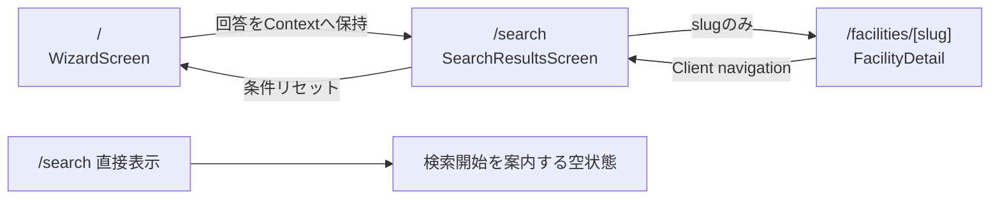

# Step 1: UI 完成（モックデータ）— 設計

## 1. 設計方針

- App Router の `app/**` はルーティングと依存の合成に限定し、表示は `presentation`、ロジックは `domain` / `application`、モック取得は `infrastructure` に分離する。
- 施設詳細は Server Component、ウィザードと検索条件 UI は必要最小限の Client Component とする。
- 検索回答はルートレイアウト配下の React Context にだけ保持する。永続化や URL クエリは使用しない。
- 参考画像の視覚言語は踏襲するが、永続要件にない機能や実データを追加しない。
- 追加 UI ライブラリは使わず、Tailwind CSS v4、CSS トークン、再利用可能な共通コンポーネントで構築する。

## 2. 画面・状態の構成

### 2.1 状態管理

- `SearchSessionProvider` を `app/providers.tsx` からルートレイアウトに組み込み、`SearchAnswers | null` をメモリ保持する。
- ウィザード完了時に Context を更新して `router.push('/search')` する。
- 検索結果では Context の回答を編集し、確定時に純粋な検索関数へ渡す。
- Client navigation の間は回答が維持される。リロードや直接アクセスで失われることはプライバシー要件どおりの挙動とし、空状態からトップへ戻せるようにする。

## 3. レイヤーと主な変更ファイル

### 3.1 App Router

- `app/layout.tsx`: 日本語 metadata、`lang="ja"`、共通 Provider、フォントクラスを設定。
- `app/providers.tsx`: Client Component として検索セッション Provider を合成。
- `app/page.tsx`: `WizardScreen` を配置する薄いルート。
- `app/search/page.tsx`: composition root からモック施設一覧を取得し `SearchResultsScreen` へ渡す。
- `app/facilities/[slug]/page.tsx`: `params: Promise<{ slug: string }>` を `await` し、詳細取得、`notFound()`、`generateStaticParams()` を実装。
- `app/not-found.tsx`: ブランドに沿った 404 とトップへの導線。
- `app/globals.css`: Tailwind エントリ、デザイントークン、基本スタイル、モーション抑制設定。

### 3.2 Facility ドメイン

- `src/modules/facility/domain/facility.ts`: `Facility`、費用、確認状況、相談方法等の型。
- `src/modules/facility/domain/derive-feature-labels.ts`: 施設属性から特徴ラベルを導出する純粋関数。
- `src/modules/facility/application/ports/facility-repository.ts`: `list` / `findBySlug` を持つポート。
- `src/modules/facility/application/usecases/`: 一覧取得、詳細取得、slug 列挙のユースケース。
- `src/modules/facility/infrastructure/InMemoryFacilityRepository.ts`: モック配列を返すポート実装。
- `src/modules/facility/infrastructure/mock-facilities.ts`: 複数区・複数属性・未掲載値を含む表示用フィクスチャ。
- `src/modules/facility/presentation/FacilityCard.tsx`: 結果カード。
- `src/modules/facility/presentation/FacilityDetail.tsx`: 詳細の全項目と代替表示。
- `src/modules/facility/index.ts`: 他層へ公開する型・関数・表示部品だけを再エクスポート。

### 3.3 Search ドメイン

- `src/modules/search/domain/search-answers.ts`: Q1〜Q3 の回答型、選択肢、ステップ検証。
- `src/modules/search/domain/search-facilities.ts`: 地域抽出、一致度算出、選択区優先の安定ソート。
- `src/modules/search/application/usecases/search-facilities.ts`: 検索ユースケースの入口。
- `src/modules/search/presentation/SearchSessionProvider.tsx`: 回答 Context。
- `src/modules/search/presentation/WizardScreen.tsx`: ヒーロー、質問、進捗、バリデーション。
- `src/modules/search/presentation/SearchResultsScreen.tsx`: 件数、条件編集、空状態、結果一覧。
- `src/modules/search/presentation/FilterPanel.tsx`: デスクトップ常設/モバイル開閉の条件 UI。
- `src/modules/search/index.ts`: 公開バレル。

### 3.4 Shared

- `src/shared/domain/wards.ts`: 横浜市18区と隣接関係。
- `src/shared/presentation/`: `SiteHeader`、`SiteFooter`、`BrandMark`、`Button`、`Tag`、`Breadcrumbs`、`EmergencyContacts`、`SupportIllustration`、小さな SVG アイコン群。
- `src/composition-root.ts`: `InMemoryFacilityRepository` を生成し、施設ユースケースへ注入する唯一の合成地点。

### 3.5 設定

- `eslint.config.mjs`: core の `no-restricted-imports` を用いて domain/application の依存方向を検査する。
- `package.json`: `typecheck` と Node.js 24 組み込み `node --test` の `test` スクリプトを追加する。
- `tsconfig.json`: Next.js と Node.js ネイティブ TypeScript テストの両方で必要な最小設定だけを調整する。

## 4. データ設計

`Facility` は UI が必要とする情報を欠落なく表現し、未確認値は `null` とする。`null` は presentation で共通の「公式サイトで確認してください」に変換する。

主要フィールド:

- 識別: `slug`, `name`
- 運営: `operator`, `operatingDepartment`
- 概要: `summary`, `whatYouCanConsult`, `whoCanUse`, `howToUse`, `eligibility`
- 検索: `ward`, `supportThemes`, `targetAudiences`
- 条件: `consultationMethods`, `cost`, `reservationRequired`, `anonymousConsultation`, `guardianOnlyConsultation`, `receptionHours`
- 信頼性: `sourceName`, `sourceUrl`, `lastCheckedAt`, `verificationStatus`
- 表示: `officialUrl`, `imageVariant`

モックは港北区を中心に、選択区・隣接区・対象外区、スコア差、未掲載値を検証できる6件程度を用意する。実在施設名に見える場合も「表示用モック」と明示し、実運用データとしては扱わない。

## 5. 検索ロジック

1. `selectedWard` と `ADJACENT_WARDS[selectedWard]` の和集合だけを候補にする。
2. Q2 の `supportTheme` 一致を主加点、Q1 の `targetAudience` 一致を副加点とする。
3. `facility.ward === selectedWard` を最優先キーにする。
4. 同一地域グループ内は `matchScore` 降順、同点は施設名で安定化する。
5. UI の順位は並び替え済み配列の index から表示し、人気度や口コミランキングとは表現しない。

具体的な加点値はドメイン定数に閉じ、テストで振る舞いを固定する。

## 6. UI デザイン

- 背景は淡い青灰、面は白、主操作は深い横浜ブルー。成功/無料は緑、保護者相談は橙、匿名等は紫で区別する。
- 最大コンテンツ幅を設け、モバイルでは画面端 16〜20px、デスクトップでは十分な余白を取る。
- ウィザードは1問ずつフォーカスして認知負荷を抑え、選択肢をアイコン付きカードとして表示する。
- 結果カードは上段に順位/名称、中央に概要と条件、下段にタグ/確認日/詳細 CTA を置く。
- 詳細は概要カードと定義リスト/テーブルを組み合わせ、長文でも行を追いやすくする。
- `prefers-reduced-motion` を尊重し、アニメーションは短い色・位置の遷移だけにする。
- モック外部導線と緊急相談表示は実運用情報と誤認されないラベルを添える。

## 7. アクセシビリティ設計

- 質問群は `fieldset` / `legend`、選択肢はネイティブ radio を利用し、カード全体を label とする。
- バリデーションエラーは対象入力と関連付け、`aria-live` で通知する。
- モバイルフィルター開閉は `aria-expanded` / `aria-controls` を付ける。
- 現在地、隣接区、確認状況は色に加えて文言/アイコンでも表す。
- 見出し順序を維持し、スキップリンクを提供する。
- 装飾 SVG は `aria-hidden`、意味を持つアイコンはテキストラベルを併設する。

## 8. プライバシー設計

- `useSearchParams`、URL クエリ、Cookie、Web Storage、Server Action、検索 API を使わない。
- 検索回答は Context の React state だけに置く。
- モック施設情報以外の外部 fetch は行わない。
- ブラウザ検証で URL、Cookie、localStorage、sessionStorage、外部リクエストを確認する。

## 9. テスト・検証

### 9.1 自動テスト

Node.js 24 の組み込みテストランナーを使用する。対象は少なくとも以下:

- ウィザードの「その他」必須判定。
- 選択区 → 隣接区の順序、および各グループ内の一致度順。
- 対象外区の除外と0件。
- 特徴ラベル導出と未掲載値の表示変換。
- 横浜市18区マスタの完全性と隣接関係の対称性。

### 9.2 品質コマンド

- `npm run lint`
- `npm run typecheck`
- `npm test`
- `npm run build`

### 9.3 実ブラウザ検証

- モバイル（390×844 前後）: Q1〜Q3、その他エラー、結果1カラム、フィルター開閉、詳細縦配置。
- デスクトップ（1440×900 前後）: 結果2カラム、カード比較、詳細レイアウト。
- キーボード: Tab、Space/Enter、戻る操作、フォーカス表示。
- プライバシー: `/search` にクエリがなく、Cookie/Storage が空で、検索内容の外部送信がない。
- 表示: 横スクロール、重なり、切れ、読めないコントラストがない。

## 10. 永続ドキュメントへの影響

- `docs/architecture.md`: Node.js 組み込みテストランナーを確定技術として追記する。
- `docs/development-guidelines.md`: テストコマンドと初回ランナー未確定の記述を更新する。
- `docs/development-roadmap.md`: 全受け入れ条件と検証完了後に Step 1 の完了状態を記録する。
- `docs/product-requirements.md`、`docs/functional-design.md`、`docs/repository-structure.md`、`docs/glossary.md`: 既存仕様を実装するため変更しない。

## 11. リスクと対策

- **状態消失**: リロードで回答が消える。プライバシー要件として受け入れ、空状態と再検索導線を用意する。
- **モックの誤認**: モックラベルとダミーリンク表記を常時表示し、実在情報として案内しない。
- **巨大な Client Component**: 状態境界を Provider、Wizard、Results、Filter に分割し、静的な詳細/共通外枠は Server Component を維持する。
- **画像への過度な依存**: イラストは装飾に留め、情報はテキストとセマンティック HTML で完結させる。
- **参考画像との差異**: ピクセルコピーではなく、情報階層、配色、余白、レスポンシブ構造を評価基準とする。
