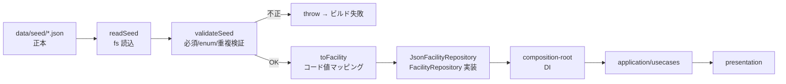

# Step 2: データ基盤（JSON / 検証 / 静的生成） — 設計

> 関連: [`requirements.md`](./requirements.md) ／ [`docs/architecture.md`](../../docs/architecture.md) ／ [`docs/repository-structure.md`](../../docs/repository-structure.md)

## 1. 実装アプローチ

シード JSON を `infrastructure` の境界で **検証 → ドメイン型へ写像** し、`FacilityRepository` ポートの実装として供給する。`domain` / `application` / `presentation` はシードの構造を知らない（アーキテクチャ原則 §3.3 疎結合・§3.4 DIP）。



- 読み込みは `node:fs` ＋ `JSON.parse`（`import` によるバンドル埋め込みではなく、境界で明示的に検証するため）。
- 検証・マッピングは**純粋関数**として切り出し、単体テスト可能にする。
- 結果はモジュール内でメモ化し、ページごとの再読込を避ける。

## 2. 変更するコンポーネント

### 2.1 新規（`src/modules/facility/infrastructure/`）

| ファイル | 責務（単一責任） |
| --- | --- |
| `seed-schema.ts` | シード JSON の型定義と**検証**。必須欠落・enum 不一致・id 重複を検出し、違反時に例外を投げる |
| `seed-mapper.ts` | 検証済みシードレコード → `Facility` エンティティへの**写像**（コード値変換のみ） |
| `JsonFacilityRepository.ts` | `FacilityRepository` の実装。ファイル読込 → 検証 → 写像 → メモ化 |

### 2.2 変更

| ファイル | 変更内容 |
| --- | --- |
| `src/modules/facility/domain/facility.ts` | `ward` / `operator` / `summary` を nullable 化。`address` / `phone` / `alternatePhone` / `costDetail` / `notes` を追加 |
| `src/shared/domain/support-taxonomy.ts` | `ConsultationMethod` に `line` / `web-form` / `phone-callback` を追加（ラベル: LINE / Webフォーム / 電話での折り返し） |
| `src/shared/domain/wards.ts` | 隣接区マスタが暫定（シード未収録）である旨のコメント。市域全体を扱うヘルパを追加 |
| `src/modules/search/domain/search-facilities.ts` | `LocationMatch` に `citywide` を追加。`ward === null` の施設を常に対象化し、並び順を 選択区 → 市域全体 → 隣接区 に |
| `src/modules/facility/presentation/FacilityDetail.tsx` | `ward`/`summary` の null 表示、住所・電話・補足（notes）・費用補足の表示 |
| `src/modules/facility/presentation/FacilityCard.tsx` | 市域全体バッジ、`ward`/`summary` の null 対応 |
| `src/composition-root.ts` | `InMemoryFacilityRepository(MOCK_FACILITIES)` → `JsonFacilityRepository` に差し替え |
| `app/facilities/[slug]/page.tsx` | `generateMetadata` の `description` が null を許容できるよう調整 |

### 2.3 削除

- `src/modules/facility/infrastructure/mock-facilities.ts`（実データへ置き換え。`InMemoryFacilityRepository` はポートの別実装・テスト用途として**残す**）

## 3. データ構造の変更（Facility エンティティ）

```diff
  readonly slug: string;              // シードの id をそのまま使用
  readonly name: string;
- readonly operator: string;
+ readonly operator: string | null;           // シード 18件 null
- readonly summary: string;
+ readonly summary: string | null;            // シードに対応項目なし → 推測で埋めない
- readonly ward: Ward;
+ readonly ward: Ward | null;                 // null = 市域全体の窓口（6件）
+ readonly address: string | null;            // 追加
+ readonly phone: string | null;              // 追加
+ readonly alternatePhone: string | null;     // 追加
  readonly cost: Cost;
+ readonly costDetail: string | null;         // 追加（例:「無料（利用登録が必要）」）
+ readonly notes: readonly string[];          // 追加（シード notes）
```

`whoCanUse` にはシードの `target_age` を写像する（「誰が利用できるか」に相当。全件充足）。

## 4. コード値マッピング表（infrastructure 境界で変換）

| 種別 | シード値 | ドメイン値 |
| --- | --- | --- |
| テーマ | `school_attendance` / `mood_anxiety` / `family_parent_child` / `bullying_friendship` / `living_financial` / `caregiving_young_carer` / `other` | `school-absence` / `low-mood` / `family` / `bullying` / `livelihood` / `caregiving` / `other` |
| 対象者 | `child` / `parent_family` / `school_staff` / `supporter` / `young_person` / `general_public` | `child` / `guardian` / `school` / `supporter` / **`child`** / **`other`** |
| 相談方法 | `phone` / `in_person` / `line` / `web_form` / `phone_callback` | `phone` / `inperson` / `line` / `web-form` / `phone-callback` |
| 費用 | `null` / 「無料」を含む文字列 | `unknown` / `free`（原文は `costDetail` に保持） |
| 確認状況 | `official_source` | `official-verified` |
| 出典名 | `provider_type` で `source_catalog` を索引 → `title` | `sourceName` |
| 画像 | （シードに無し）`provider_type` から決定的に選択 | `imageVariant`（装飾目的のみ・事実情報ではない） |

> 未知のコード値が現れた場合は**黙って捨てず検証エラーにする**（スキーマ変更の見落としを防ぐ）。

## 5. 検索順序の変更

```
1. 選択区の施設      （一致度スコア降順 → 施設名昇順）
2. 市域全体の窓口    （同上）
3. 隣接区の施設      （同上）
```

- 市域全体（`ward === null`）は地域選択に関わらず常に候補に含める。区の縛りが無く誰でも使えるため、隣接区より前に置く。
- カードには「市全域」「〇〇区」「隣接 〇〇区」が判別できる表示を出す（AC-9）。

## 6. スキーマ検証の方針

- 外部ライブラリを使わず、TypeScript の型ガード＋明示的チェックで実装（AC-3）。
- 検証項目:
  - トップレベル: `schema_version` / `support_providers` の存在と型
  - レコード必須: `id` / `name` / `provider_type` / `themes` / `target_users` / `consultation_methods` / `target_age` / `source_url` / `checked_at` / `verification_status`
  - enum 整合: テーマ・対象者・相談方法・確認状況・`ward_code`（18区 or null）
  - 一意性: `id` の重複禁止
- 違反時は**どのレコードのどの項目か**が分かるメッセージを付けて `throw`（ビルド失敗＝AC-2）。

## 7. 影響範囲の分析

| 領域 | 影響 |
| --- | --- |
| ドメイン型の nullable 化 | `presentation` 全般・既存テストのフィクスチャに影響。型エラーを手掛かりに網羅的に修正 |
| `ConsultationMethod` 拡張 | ラベル辞書を引くだけの実装のため、追加は後方互換 |
| 検索順序 | `search-facilities.test.ts` に市域全体のケースを追加 |
| 静的生成 | 3件 → 84件に増加。ビルド時間とページ数を `npm run build` で確認 |
| プライバシー | 変更なし（サーバ側でのデータ読込のみ。ユーザー入力は送らない） |

## 8. 永続的ドキュメントの更新方針（Step 7 で実施）

| ファイル | 更新内容 |
| --- | --- |
| `architecture.md` | データ形式を JSON に。§4 の取り込み図を `data/seed/*.json` に。検証は自前実装（追加依存なし）と確定 |
| `repository-structure.md` | `data/` の構成を JSON データセットに。「1施設=1ファイル(YAML)」を改訂 |
| `functional-design.md` | 構成図の YAML 表記、ER 図（nullable・新規項目）、検索順序に市域全体を追加 |
| `glossary.md` | シードのコード値 ↔ ドメイン値の対応表、相談方法の追加値、「市域全体」の用語を追加 |
| `development-guidelines.md` | Git 規約のデータ更新パス（`data/facilities/*.yaml` → JSON 正本）を修正 |
| `development-roadmap.md` | Step 2 の内容を JSON ベースに修正し、完了状態を記録 |
| `product-requirements.md` | AC-05（並び順）に市域全体の扱いを追記 |

## 9. リスクと対応

| リスク | 対応 |
| --- | --- |
| シードに `summary` が無く、詳細ページの情報密度が下がる | 推測で補完せず未掲載表示。`notes`・`target_age`・`hours` 等の事実情報を表示して補う |
| 隣接区マスタが未検証（シード側は not_included） | コード側マスタを継続利用しつつ、要検証である旨をドキュメントに明記。Step 4 で境界データによる検証を課題化 |
| 84件の静的生成でビルドが重くなる | `npm run build` で実測し、問題があれば Step 5 で最適化 |
| 全件 `official_source` = 運営者確認済みが0件 | 事実どおり「公式情報確認済み」と表示。格上げは Step 4 の運用課題 |
