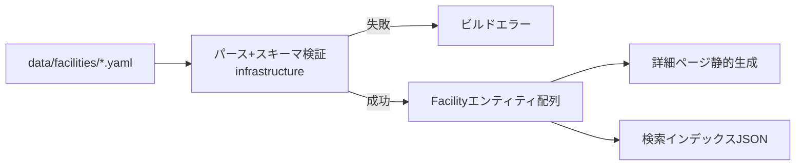

# 技術仕様書 (Architecture)

> 関連: [`functional-design.md`](./functional-design.md) / [`repository-structure.md`](./repository-structure.md) / [`development-guidelines.md`](./development-guidelines.md)

## 1. テクノロジースタック

| 分類 | 採用 | 備考 |
| --- | --- | --- |
| フレームワーク | **Next.js 16.2.12**（App Router） | Server Components デフォルト。静的生成中心 |
| UI ライブラリ | **React 19.2.4** | |
| 言語 | **TypeScript 5**（strict） | `noEmit`, `moduleResolution: bundler` |
| スタイリング | **Tailwind CSS v4**（`@tailwindcss/postcss`） | ユーティリティ＋デザイントークン |
| ランタイム | **Node.js 24.18.0** | `.nvmrc` / Volta で固定 |
| Lint | **ESLint 9**（`eslint-config-next`） | flat config (`eslint.config.mjs`) |
| テスト | **Node.js 組み込みテストランナー** | TypeScript の `*.test.ts` を `node --test` で実行。追加依存なし |
| データ形式 | **YAML / JSON** | 施設情報の正本。DB は持たない |
| デプロイ | 静的ホスティング想定（例: Vercel / 静的エクスポート） | MVP はサーバ状態を持たない |

> **重要**: 本プロジェクトの Next.js はバージョン固有の破壊的変更を含む。実装前に必ず `node_modules/next/dist/docs/01-app/` の該当ガイドを参照する（`AGENTS.md`）。確認済みの主要事項:
> - `params` / `searchParams` は **Promise**。Server Component では `await`、Client Component では `use()` で解決する。
> - App Router はデフォルトで **Server Component**。ブラウザ状態・イベントが必要な部分のみ `'use client'` を付ける。

## 2. 全体アーキテクチャ方針

- **静的データ駆動**: 施設情報（YAML/JSON）をビルド時に読み込み・検証し、詳細ページを静的生成（`generateStaticParams`）する。同時にクライアント用の検索インデックス JSON を生成する。
- **クライアント内検索**: 3問ウィザードの絞り込み・並び替えはブラウザ内で完結。ユーザー入力をサーバに送らず、URL・Cookie・localStorage にも保存しない（プライバシー要件）。
- **モバイルファースト**: すべての画面をモバイル前提で設計し、デスクトップは拡張（結果画面の2カラム等）。
- **ドメイン駆動 × レイヤード（モジュラモノリス）**: `src/modules/<domain>/{domain,application,infrastructure,presentation}` ＋ `src/shared/`。`app/**` は Next.js のルーティング層（framework presentation）として薄く保ち、モジュールの presentation を合成する。

## 3. アーキテクチャ原則の担保

本プロジェクトは以下4原則を**文書とコードの両方で**担保する。運用規約は [`development-guidelines.md`](./development-guidelines.md) を参照。

### 3.0 ドメイン分割

- 境界づけられたコンテキスト: `facility` / `search` / `shared`（横断）。将来ドメインは `src/modules/<domain>/` に追加。
- ドメイン間は疎結合。`search` は `facility` の**公開ドメイン型とポート**にのみ依存し、他ドメインの `infrastructure` 内部を import しない。共有物は `shared` 経由。

### 3.1 単一責任（SRP）

- `presentation`: 表示・入力受付のみ。ビジネスロジックを持たない。
- `application`: ユースケースの調停とポート定義。
- `domain`: エンティティ・値オブジェクト・ドメインルール（確認状況、一致度スコア算出など）。
- `infrastructure`: 外部 I/O（YAML/JSON 読み込み・解析、アクセス解析送信）。ポートの実装。

### 3.2 一方向依存

- 依存方向: `app/** → presentation → application → domain`。
- `application` は `presentation` を参照しない。`domain` は上位を参照しない最内層。循環依存を作らない。
- **機械的検出**: ESLint の `no-restricted-imports` / `eslint-plugin-import` で層またぎを制約する。グロブ例:
  - `src/modules/*/domain/**` は `application`/`infrastructure`/`presentation`/`next`/`react` を import 不可（最内層）。
  - `src/modules/*/application/**` は `infrastructure`/`presentation` の具象を import 不可（ポート経由のみ）。
  - あるモジュールから他モジュールの `infrastructure`/`presentation` 内部への import を禁止（`shared` と公開バレル経由のみ）。

### 3.3 疎結合

- 外部ライブラリ（YAML パーサ等）の固有型を `domain`/`application` の公開シグネチャに漏らさない。
- 外部データは `infrastructure` の境界で検証し、**ドメイン型（DTO/エンティティ）へ変換**してから上位へ返す。

### 3.4 依存性逆転（DIP）

- `application`/`domain` は infrastructure の**抽象（ポート interface）**に依存する。
- ポート定義場所と実装場所:
  - `FacilityRepository`（interface）: `src/modules/facility/application/ports/facility-repository.ts`。実装: `src/modules/facility/infrastructure/`（YAML/JSON ローダ）。
  - `AnalyticsGateway`（interface）: `src/shared/application/ports/`（または `src/shared/analytics/`）。実装: `src/shared/infrastructure/`（クライアントアダプタ）。
- 具象は**合成ルート**（`src/composition-root.ts` 等、または各 route の入口）で束ねて注入する。

## 4. データ取り込みと生成

- スキーマ検証はビルド時に実施し、必須項目欠落・enum 不一致はビルドを失敗させる（不正データの公開を防ぐ）。
- 検証・型の単一情報源として TypeScript の型＋ランタイムバリデーション（軽量バリデータ）を用いる。ライブラリ選定は初回実装ステアリングで確定（追加依存は最小限）。

## 5. ルーティング（App Router）

| パス | 種別 | 内容 |
| --- | --- | --- |
| `/` | 静的 | トップ＋3問ウィザード導入 |
| `/search` | 静的（クライアント状態で結果描画） | ウィザード回答→結果一覧。※検索条件は URL に含めない |
| `/facilities/[slug]` | 静的生成（`generateStaticParams`） | 施設詳細 |
| （共通） | レイアウト/コンポーネント | 緊急相談セクション・パンくず 等 |

- 検索条件を URL クエリに載せないため、`/search` はクライアント状態で結果を描画する（ディープリンク・共有は MVP では非対応＝プライバシー優先）。

## 6. パフォーマンス要件

- モバイルで軽快に動作。静的生成・プリレンダリングを基本とし、クライアント JS を最小化。
- 検索インデックス JSON は MVP 規模（30〜50件）に最適化。将来件数増に備え、必要になった時点で分割・遅延読み込みを検討。
- 画像/イラストは最適化して配信。

## 7. セキュリティ・プライバシー技術方針

- Cookie / localStorage / sessionStorage にユーザーの相談内容を保存しない。
- 検索内容を URL パラメータやクエリに含めない。
- 外部送信は「最小限のアクセス解析（閲覧数・公式クリック数）」のみで、個人を特定しない。フィンガープリント・セッションリプレイを使用しない。
- 外部リンク（公式サイト）は `target="_blank"` ＋ `rel="noopener noreferrer"`、外部遷移が分かる表示。
- 入力バリデーション・XSS 対策（React の既定エスケープを尊重し、`dangerouslySetInnerHTML` を避ける）。

## 8. アクセシビリティ

- WCAG 2.1 AA 目標。セマンティック HTML、フォーカス可視化、キーボード操作、コントラスト比、タップ領域確保。
- ウィザードのボタン選択肢は適切なラベル・ロールを付与。

## 9. 技術的制約

- MVP はバックエンド DB・管理画面・ログインを持たない。情報更新は Google フォーム受付＋ PR。
- 追加依存は最小限（プライバシー・監査容易性・OSS としての可読性を優先）。
- Node/Next のバージョンは固定（`.nvmrc` / `package.json`）。
