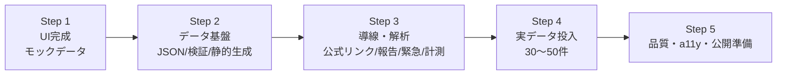

# 開発工程 (Development Roadmap)

> 関連: [`product-requirements.md`](./product-requirements.md) / [`functional-design.md`](./functional-design.md)
>
> **方針: UI ファースト**。最初のステップで、モックデータを用いて全画面の UI を完成させる。その後、実データ・検証・解析を順に載せる。各ステップは `.steering/<YYYYMMDD>-<タイトル>/` を作成して進める（[dev-docs](../CLAUDE.md) 参照）。

## 全体像

---

## Step 1: UI 完成（モックデータ）★最初に完成させる

**状態: 完了（2026-07-27）**

**ゴール**: 実データ・バックエンドなしで、モック（フィクスチャ）データを用いて**全画面の UI と画面遷移が一通り動く**状態にする。デザイン・レスポンシブ・アクセシビリティの土台をここで固める。

- 骨組み: `src/modules/{facility,search}`・`src/shared` のディレクトリと、Tailwind デザイントークン・共通 UI プリミティブ（ボタン／タグ／パンくず／緊急セクション）を用意。
- モックデータ: `FacilityRepository` ポートの**インメモリ実装**（数件のサンプル施設）を用意し、UI はポート経由で参照（実データ差し替えを容易にする）。
- 画面:
  1. **トップ + Q1〜Q3 ウィザード** — 単一選択ボタン、「その他」自由記述必須のバリデーション、3問で結果へ。
  2. **検索結果一覧** — 件数表示、カード（順位・施設名・運営主体・概要・区名・相談方法・費用・タグ・確認状況・詳細導線）、選択区優先＋隣接区の区別、条件変更・再検索。モバイル1カラム／デスクトップ2カラム。
  3. **施設詳細** — 要求メモの全項目を縦配置、未掲載項目は「公式サイトで確認してください」、特徴ラベル、公式リンク（ダミー）、報告導線（ダミー）、緊急セクション。
- ドメインロジック（仮）: 一致度スコア・区/隣接区抽出・並び替えの**純粋関数**を実装（モックデータで動作）。
- プライバシー: 検索条件を URL/Storage に載せない実装をこの時点から徹底。
- **完了条件**: トップ→3問→結果→詳細まで、モックデータで破綻なく遷移でき、モバイル/デスクトップ両方でレイアウトが成立する。

## Step 2: データ基盤（JSON / 検証 / 静的生成）

**状態: 完了（2026-07-28）**

**ゴール**: モックを実ファイル駆動に置き換える。

- 正本は `data/seed/*.json`（データセット単位の JSON。施設84件・区マスタ・コード辞書・出典カタログ）。
- `facility/infrastructure` に検証（`seed-schema.ts`）・写像（`seed-mapper.ts`）・`JsonFacilityRepository` を実装。必須欠落・未知の enum 値・id 重複でビルド失敗。検証は追加依存なしの自前実装。
- `/facilities/[slug]` を `generateStaticParams` で静的生成（84件）。同じ経路で検索用の施設一覧を供給。
- `composition-root` で本実装を注入し、Step 1 のインメモリ実装から切替（モックデータは削除）。
- 正本の実態に合わせたドメイン調整: 市域全体の窓口（`ward: null`）の導入と並び順（選択区 → 市域全体 → 隣接区）、住所・電話・補足・費用原文の追加、`summary` 等は未掲載として扱う。
- **完了条件**: 実データ84件で静的生成・検索が動作し、検証テストが通る。 → 達成（lint / typecheck / test 30件 / build すべて green）。

## Step 3: 導線・アクセス解析

**状態: 導線は完了（2026-07-29）／アクセス解析が残**

**ゴール**: 外部導線と最小限の計測を有効化。

- ✅ 公式サイトリンク（URL 未登録なら非表示・新規タブ・外部遷移明示）。
- ✅ 「この情報が古い場合は知らせる」→ Google フォーム（新しいタブ・利用者情報を渡すパラメータは付けない）。
- ✅ 緊急セクションに実在する相談窓口（24時間こどもSOSダイヤル／チャイルドライン）と通報先（110/119）を掲載。電話は `tel:` リンク。
- ✅ 施設詳細の電話番号も `tel:` リンク化。
- ⬜ `AnalyticsGateway` ポート＋実装で「詳細ページ閲覧数」「公式サイトを見る クリック数」のみ計測（個人非特定・Cookie/セッションリプレイ不使用）。
- **完了条件**: 各導線が正しく動作し、計測が2種のみ・プライバシー要件を満たすことをテストで確認。

## Step 4: 実データ投入

**ゴール**: 横浜市内の不登校支援 **30〜50件**を出典・確認日付きで掲載。

- データ収集・確認ガイドに沿って正本 JSON を PR で追加・拡充。
- **区の隣接関係を公式地理データで検証**し、暫定マスタ（`shared/domain/wards.ts`）を確定させる（正本は v0.1 時点で `ward_adjacency: not_included`）。
- 確認状況（運営者確認済み／公式情報確認済み／未確認）を正しく付与。シード v0.1 は全件「公式情報確認済み」のため、運営者確認の取得を進める。
- 正本の再配布条件（各出典サイトの利用条件・著作権方針）の確認。
- **完了条件**: 目標件数を掲載し、利用者が3問で自分に合いそうな支援先を2〜3件見つけられる。

## Step 5: 品質・アクセシビリティ・公開準備

**ゴール**: 公開できる品質に仕上げる。

- WCAG 2.1 AA 準拠チェック（キーボード・スクリーンリーダー・コントラスト）。
- パフォーマンス最適化（静的化・JS 最小化・画像最適化）。
- プライバシー回帰テスト（URL/Storage 非保存・外部送信2種のみ）。
- OSS ドキュメント（コントリビュートガイド・掲載基準・編集方針・安全/プライバシー方針）整備。
- リンク切れ・情報鮮度チェックの運用整備。
- **完了条件**: 全受け入れ条件（[product-requirements](./product-requirements.md) §5）を満たし、公開準備が整う。

---

## 各ステップ共通の進め方

1. `.steering/<YYYYMMDD>-<タイトル>/` に `requirements.md` / `design.md` / `tasklist.md` を作成。
2. 実装前に承認ゲート。
3. 実装 → `npm run lint` ・型チェック・関連テスト。
4. アーキテクチャ原則（SRP・一方向依存・疎結合・DIP・ドメイン分割）との整合を確認。
5. PR → レビュー → `main` マージ。
