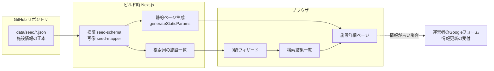
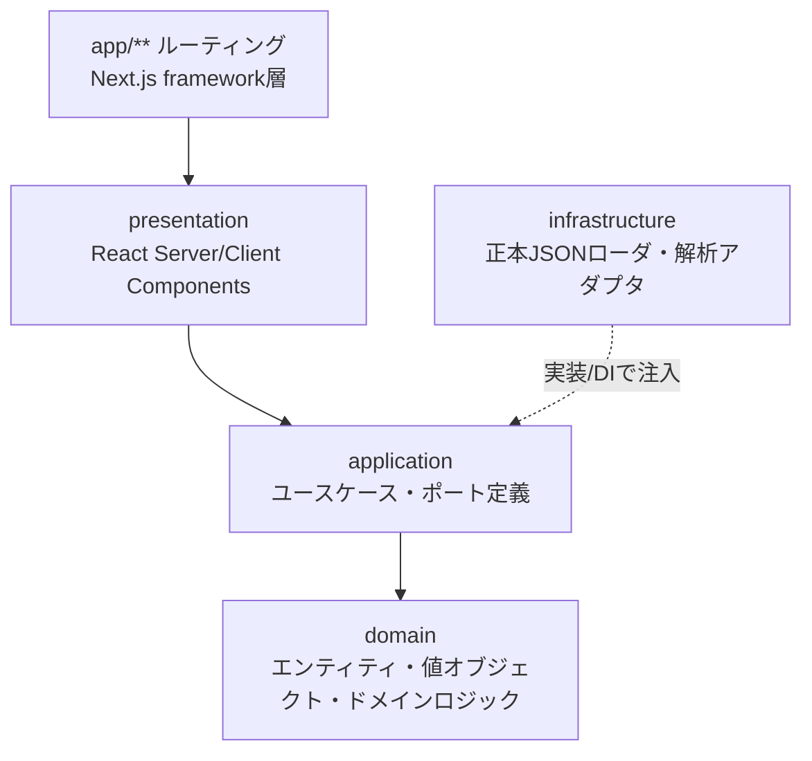
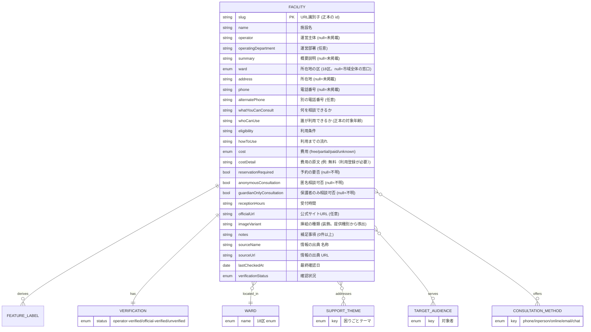
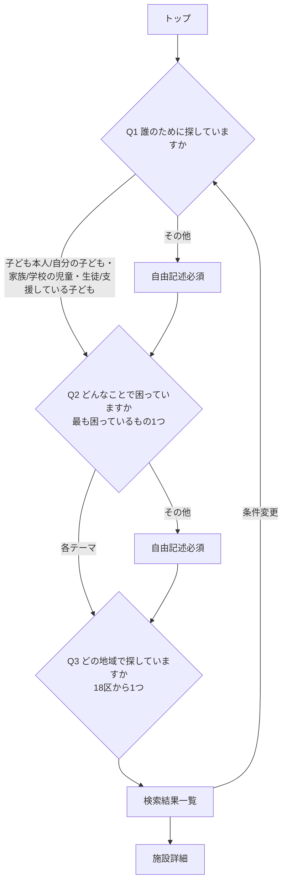
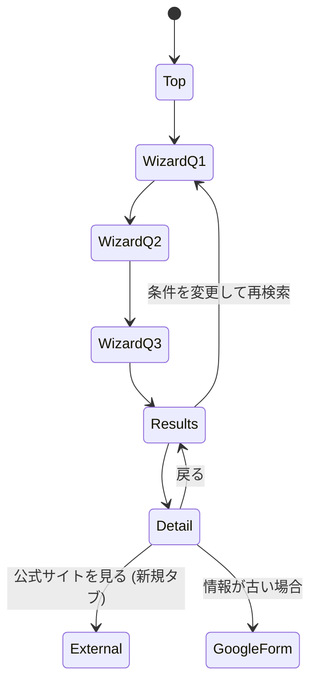

# 機能設計書 (Functional Design)

> 関連: [`product-requirements.md`](./product-requirements.md) / [`architecture.md`](./architecture.md) / [`repository-structure.md`](./repository-structure.md)

## 1. システム構成

施設情報の正本は GitHub リポジトリ内の JSON（データセット単位の1ファイル）。ビルド時にデータを読み込み・検証し、静的な詳細ページと検索用の施設一覧を生成する。検索・絞り込みは**クライアント内（ブラウザ）**で完結し、ユーザーの入力をサーバへ送らない・URL に含めない（プライバシー要件）。



- ユーザー入力（Q1〜Q3 の回答）はクライアント状態としてのみ保持し、URL・Cookie・localStorage・サーバのいずれにも保存しない。
- 詳細ページは静的生成（施設ごと `/facilities/[slug]`）。

## 2. ドメイン分割（境界づけられたコンテキスト）

推奨構成「ドメイン駆動 × レイヤード（モジュラモノリス）」を採用する。

| ドメイン | 責務 |
| --- | --- |
| `facility` | 施設情報のドメインモデル・確認状況・データ取得（リポジトリポート）・正本 JSON の検証と写像・詳細表示 |
| `search` | 3問ウィザードのフロー、絞り込み・並び替え（一致度スコアリング）、結果一覧表示 |
| `shared` | 区・隣接区マスタ、緊急相談先、確認状況ラベル、UI プリミティブ、アクセス解析ポート等の横断関心事 |

- ドメイン間は疎結合。`search` は `facility` の**公開型（ドメイン型）とポート**にのみ依存し、`facility/infrastructure` の内部実装を直接 import しない。
- 共有する参照データ（区・隣接区、緊急相談先）と UI プリミティブは `shared` に置く。
- 将来ドメイン（メンタルヘルス、ヤングケアラー 等）は `src/modules/<domain>/` として追加する。

各ドメイン内のレイヤーと依存方向（一方向）:



- 依存方向: `app/** → presentation → application → domain`。`infrastructure` は `application` が定義したポート（interface）を実装し、合成ルート（composition root）で注入する（依存性逆転）。
- `domain` はどのレイヤーにも依存しない最内層。外部 SDK/ライブラリ固有の型を `domain`/`application` に漏らさない。

## 3. データモデル

### 3.1 Facility（施設）エンティティ



**未確認・未掲載の扱い**: 各任意項目は値が無い場合 `null` を保持し、UI では**空欄にせず**「公式サイトで確認してください」と表示する（推測で埋めない）。正本に対応項目が無い `summary` / `whatYouCanConsult` / `eligibility` / `howToUse` も、文章を生成せず未掲載として扱う。

**市域全体の窓口**: `ward` が `null` の施設は特定の区に属さない市域全体の窓口を表し、「市全域」と表示する。地域の選択にかかわらず検索結果に含める。

### 3.2 列挙値（enum）

- **Ward（18区）**: 鶴見 / 神奈川 / 西 / 中 / 南 / 港南 / 保土ケ谷 / 旭 / 磯子 / 金沢 / 港北 / 緑 / 青葉 / 都筑 / 戸塚 / 栄 / 泉 / 瀬谷。
- **SupportTheme（困りごと=Q2）**: `school-absence`(学校に行けない・行きづらい) / `low-mood`(気分の落ち込み・不安) / `family`(家庭や親子関係) / `bullying`(いじめ・友人関係) / `livelihood`(生活や経済面) / `caregiving`(子どもの世話や家族のケア) / `other`。
- **TargetAudience（対象者=Q1）**: `child`(子ども本人) / `guardian`(自分の子ども・家族) / `school`(学校の児童・生徒) / `supporter`(支援している子ども) / `other`。
- **ConsultationMethod（相談方法）**: `phone` / `inperson` / `online` / `email` / `chat` / `line` / `web-form` / `phone-callback`。
- **Cost（費用）**: `free`(無料) / `partial`(一部有料) / `paid`(有料) / `unknown`(不明)。
- **VerificationStatus（確認状況）**: `operator-verified`(運営者確認済み) / `official-verified`(公式情報確認済み) / `unverified`(未確認)。

### 3.3 特徴ラベル（派生）

詳細・カードに表示する特徴ラベルは施設属性から派生させる: 「無料」(cost=free) / 「保護者相談可」(guardianOnlyConsultation=true) / 「予約可 or 予約不要」 / 「匿名相談可」 / 「公式情報確認済み」(verificationStatus)。

### 3.4 区・隣接区マスタ（shared 参照データ）

- 横浜市18区の隣接関係を静的マスタとして保持し、検索時に「選択区＋隣接区」＋市域全体の窓口を対象にする。
- 隣接関係は `shared` のリファレンスデータ（`wards.ts` の `ADJACENT_WARDS`）として定義し、facility/search 双方が参照する。
- **注意（暫定データ）**: 正本データセットは `ward_adjacency: not_included` として隣接関係を持たない（行政区境界の公式地理データによる検証が未了のため）。コード側のマスタは通いやすさの目安であり、公式地理データでの検証は Step 4 の課題とする。

## 4. 検索・絞り込みの仕様

### 4.1 ウィザード（3問・単一選択）



- Q1・Q2 は「その他」選択時のみ自由記述欄を表示し、**入力必須**（未入力では次へ進めない）。
- MVP は3問固定。4問目は設けない。運営後に実利用データを見て拡張する。
- 回答状態はクライアントのメモリ上のみで保持（URL/保存なし）。

### 4.2 絞り込みと並び替え（一致度スコアリング）

1. **対象施設の抽出**: Q3 で選んだ区 ∪ その隣接区に所在する施設、および区に属さない**市域全体の窓口**を候補とする。
2. **一致度スコア算出**: Q2（困りごとテーマ）を主軸に、Q1（対象者）や属性の一致で加点する。
3. **並び順**:
   - 第1キー: 所在地の区分（**選択区 → 市域全体 → 隣接区**）。市域全体の窓口は区の縛りなく誰でも使えるため、隣接区より前に置く。
   - 第2キー: 各グループ内で一致度スコアの高い順。
   - 第3キー: 施設名（日本語の昇順）。
4. **件数表示**: 合致件数を「検索結果 ○件」と明示（初期表示件数は固定しない）。
5. **順位**: 上記並び順に基づきカードへ順位を付与。

> スコアリングの重み付けは MVP では単純な加点方式とし、実データ・利用状況を見て調整する（[development-roadmap](./development-roadmap.md)）。

## 5. 画面設計（ワイヤーフレーム）

### 5.1 画面遷移



### 5.2 検索結果（モバイル1カラム / デスクトップ2カラム）

切り替えは **`md`（768px）** を境界とする。768px 以上は絞り込みサイドバーを常時表示する2カラム、768px 未満は1カラム＋折りたたみ。折りたたみの表示制御は `max-md:hidden` に限定し、`hidden` と `block` を同一要素で競合させない（CSS の出力順に依存して崩れるため）。

```
モバイル                        デスクトップ
┌─────────────────┐    ┌───────────┬───────────────────┐
│ [絞り込み ▾]     │    │ 絞り込み   │ 検索結果 12件      │
│ 検索結果 12件    │    │ ┌───────┐ │ ┌───────────────┐ │
│ ┌─────────────┐ │    │ │Q1 …   │ │ │#1 施設名        │ │
│ │#1 施設名     │ │    │ │Q2 …   │ │ │運営主体/区名    │ │
│ │運営主体 区名 │ │    │ │Q3 …   │ │ │概要 タグ…       │ │
│ │概要 タグ…    │ │    │ │[再検索]│ │ │[詳細を見る]     │ │
│ │[詳細を見る]  │ │    │ └───────┘ │ └───────────────┘ │
│ └─────────────┘ │    │           │ ┌───────────────┐ │
│ ┌─────────────┐ │    │           │ │#2 …            │ │
└─────────────────┘    └───────────┴───────────────────┘
```

- カード表示項目: 順位 / 施設名 / 運営主体 / 概要 / 区名（「選択した区」「市全域から利用可」「隣接区」を区別）/ 相談方法 / 費用 / 対象者・相談条件タグ / 確認状況 / 詳細への導線。

### 5.3 施設詳細（モバイルファースト・縦配置）

```
┌──────────────────────────────┐
│ パンくず: ホーム > 検索結果 > 施設名 │
│ [イラスト/画像]                     │
│ 施設名                              │
│ 運営部署・運営主体                  │
│ [無料][保護者相談可][予約可][公式確認済] │
│ ── 概要説明 ──                      │
│ 何を相談できるか / 誰が利用できるか │
│ 利用までの流れ / 相談方法 / 費用    │
│ 利用条件                            │
│ ・未掲載項目 →「公式サイトで確認してください」│
│ [公式サイトを見る ↗ (新規タブ)]     │
│ 情報の出典 / 最終確認日             │
│ [この情報が古い場合は知らせる →Googleフォーム]│
│ ═══ 今すぐ助けが必要な場合 ═══      │
│ (緊急通報・公的相談窓口・固定表示)  │
└──────────────────────────────┘
```

## 6. 主要ユースケース（application 層）

| ユースケース | 入力 | 出力 | 所属 |
| --- | --- | --- | --- |
| 支援先を検索する | Q1〜Q3 の回答 | 並び替え済み結果リスト＋件数 | `search/application` |
| 施設詳細を取得する | slug | Facility（詳細表示用） | `facility/application` |
| 静的パスを列挙する | — | 全施設 slug | `facility/application` |
| アクセスイベントを記録する | 種別（詳細閲覧 / 公式クリック）＋slug | void | `shared`（AnalyticsGateway ポート） |

- ポート例: `FacilityRepository`（`facility/application/ports`）— 実装は `facility/infrastructure`（`JsonFacilityRepository`。テスト用に `InMemoryFacilityRepository`）。`AnalyticsGateway`（`shared`）— 実装はクライアントアダプタ。合成ルートで注入する。

## 7. アクセス解析（プライバシー配慮）

- 記録対象は「詳細ページ閲覧数」「公式サイトを見る のクリック数」の2種のみ。
- 個人を特定しない・Cookie/フィンガープリント/セッションリプレイを用いない・検索内容を送らない。
- `AnalyticsGateway` ポート経由で記録し、実装差し替えを可能にする（MVP の実装方式は architecture 側で確定）。
