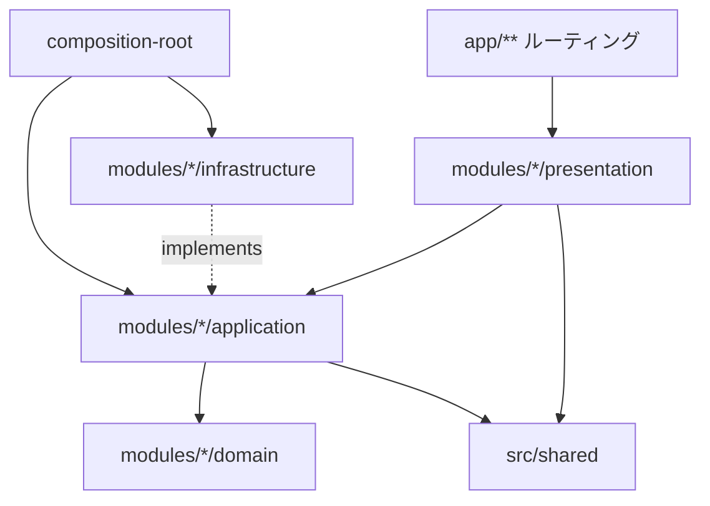

# リポジトリ構造定義書 (Repository Structure)

> 関連: [`architecture.md`](./architecture.md) / [`development-guidelines.md`](./development-guidelines.md)

## 1. 全体構成

ドメイン駆動 × レイヤード（モジュラモノリス）。`app/**` は Next.js のルーティング層（framework presentation）として薄く保ち、業務ロジックは `src/modules/<domain>/` と `src/shared/` に置く。施設情報の正本は `data/seed/` の JSON。

```
kodomo-support-commons/
├─ app/                         # Next.js App Router（ルーティング層・薄い）
│  ├─ layout.tsx                # ルートレイアウト（共通・緊急セクション等の土台）
│  ├─ page.tsx                  # トップ（ウィザード導入）
│  ├─ globals.css               # Tailwind エントリ
│  ├─ search/
│  │  └─ page.tsx               # 検索結果（クライアント状態で描画・URLに条件を載せない）
│  └─ facilities/
│     └─ [slug]/
│        └─ page.tsx            # 施設詳細（generateStaticParams で静的生成）
│
├─ src/
│  ├─ modules/
│  │  ├─ facility/              # ドメイン: 施設情報
│  │  │  ├─ domain/             # エンティティ・値オブジェクト・確認状況ロジック
│  │  │  ├─ application/
│  │  │  │  ├─ ports/           # FacilityRepository 等の interface（ポート）
│  │  │  │  └─ usecases/        # getFacilityDetail / listFacilitySlugs 等
│  │  │  ├─ infrastructure/     # 正本JSONのローダ・検証・写像（ポート実装）
│  │  │  │  ├─ seed-schema.ts   #   正本の型と検証（必須/enum/id重複）
│  │  │  │  ├─ seed-mapper.ts   #   正本のコード値 → ドメイン型への写像
│  │  │  │  └─ JsonFacilityRepository.ts
│  │  │  ├─ presentation/       # 詳細ページ用コンポーネント（カード内表示含む）
│  │  │  └─ index.ts            # 公開バレル（他ドメインが参照してよい API のみ）
│  │  └─ search/                # ドメイン: 3問ウィザード＋絞り込み
│  │     ├─ domain/             # 一致度スコアリング・回答モデル
│  │     ├─ application/
│  │     │  └─ usecases/        # searchFacilities（結果並び替え・件数）
│  │     ├─ presentation/       # ウィザード UI・結果一覧・カード
│  │     └─ index.ts
│  ├─ shared/
│  │  ├─ domain/                # 区・隣接区マスタ、確認状況ラベル等の共有型
│  │  ├─ application/
│  │  │  └─ ports/              # AnalyticsGateway 等の横断ポート
│  │  ├─ infrastructure/        # アクセス解析クライアントアダプタ 等
│  │  └─ presentation/          # UI プリミティブ（ボタン/タグ/パンくず/緊急セクション）
│  └─ composition-root.ts       # ポート実装の生成・注入（合成ルート）
│
├─ data/
│  └─ seed/                     # 施設情報の正本（データセット単位の JSON）
│     └─ yokohama_support_seed_v0.1.json
│
├─ public/                      # 静的アセット（イラスト・favicon 等）
├─ docs/                        # 永続的ドキュメント（本書群）
├─ .steering/                   # 作業単位ドキュメント
├─ AGENTS.md / CLAUDE.md        # エージェント向け規則
├─ next.config.ts / tsconfig.json / eslint.config.mjs / postcss.config.mjs
└─ package.json / .nvmrc
```

## 2. ディレクトリの役割

| パス | 役割 |
| --- | --- |
| `app/**` | Next.js のルーティング・レイアウト。モジュールの `presentation` を合成するだけの薄い層 |
| `src/modules/<domain>/domain` | 最内層。エンティティ・値オブジェクト・ドメインルール。外部・上位に非依存 |
| `src/modules/<domain>/application` | ユースケースとポート（interface）定義。`domain` のみに依存 |
| `src/modules/<domain>/infrastructure` | 外部 I/O（正本 JSON の読込・検証・写像）。ポートを実装 |
| `src/modules/<domain>/presentation` | React コンポーネント。`application` のユースケース／公開型に依存 |
| `src/modules/<domain>/index.ts` | 公開バレル。他ドメインへ公開する型・関数のみを再エクスポート |
| `src/shared/**` | 複数ドメインで共有する型・基盤・UI・横断ポート |
| `src/composition-root.ts` | 具象アダプタを生成しユースケースへ注入する合成ルート |
| `data/seed` | 施設情報の正本（JSON）。PR で追加・修正し、公開前にレビュー必須 |

## 3. ファイル配置ルール

- **ドメイン優先**: 機能はまず所属ドメイン（`facility` / `search` / `shared`）を決め、その中でレイヤーを選ぶ。
- **正本はデータセット単位の JSON**: `data/seed/<dataset>_v<version>.json` に施設・区マスタ・コード辞書・出典カタログをまとめる。施設の `id` がそのまま URL の `slug` になるため、一意かつ URL に使える形式（英小文字・数字・ハイフン）にする。
- **スキーマ検証の単一情報源**: 正本の形と許可値は `src/modules/facility/infrastructure/seed-schema.ts` が持つ。正本の項目・コード値を増やすときはここも更新する。
- **公開は index.ts 経由**: 他ドメインから参照される型・関数は各ドメインの `index.ts`（公開バレル）にのみ出す。`domain`/`infrastructure` の内部ファイルを他ドメインから直接 import しない。
- **共有物は shared へ**: 区・隣接区、緊急相談先、UI プリミティブ、横断ポートは `src/shared` に置く。
- **命名**: ファイルは kebab-case、React コンポーネントファイルは PascalCase（詳細は [development-guidelines](./development-guidelines.md)）。

## 4. 依存方向のルール（重要）



- 許可: `app → presentation → application → domain`。`infrastructure` は `application` のポートを**実装**し、合成ルートで注入。
- 禁止: `domain → 上位`、`application → infrastructure/presentation の具象`、`あるドメイン → 他ドメインの infrastructure/presentation 内部`、循環依存。
- 依存性逆転: リポジトリ／ゲートウェイのポート interface は `application/ports`（ドメイン固有ルールに紐づくなら `domain`）に定義し、実装は同ドメインの `infrastructure`。注入は `composition-root`。
- これらは ESLint の import 制約で機械的に検出する（[architecture](./architecture.md) §3.2、[development-guidelines](./development-guidelines.md)）。

## 5. パスエイリアス

- `tsconfig.json` の `@/*` → `./*`。例: `@/src/modules/facility`、`@/src/shared`。
